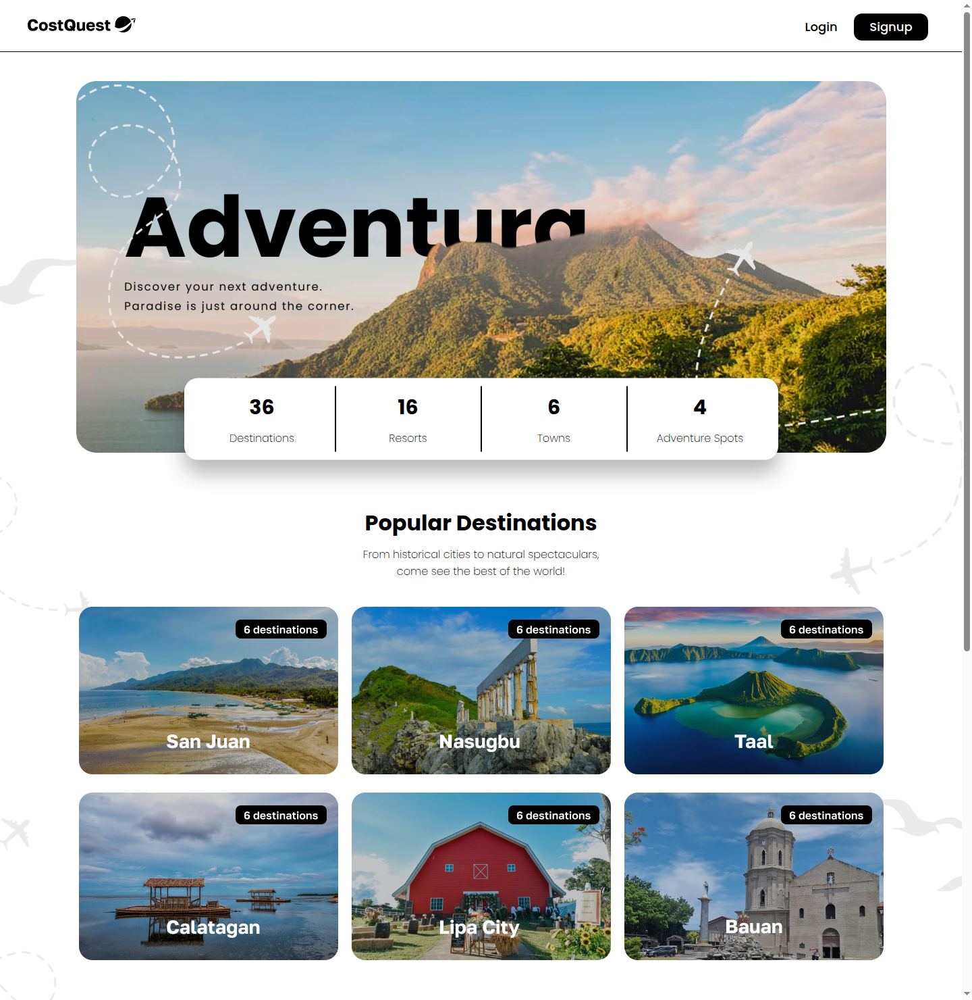
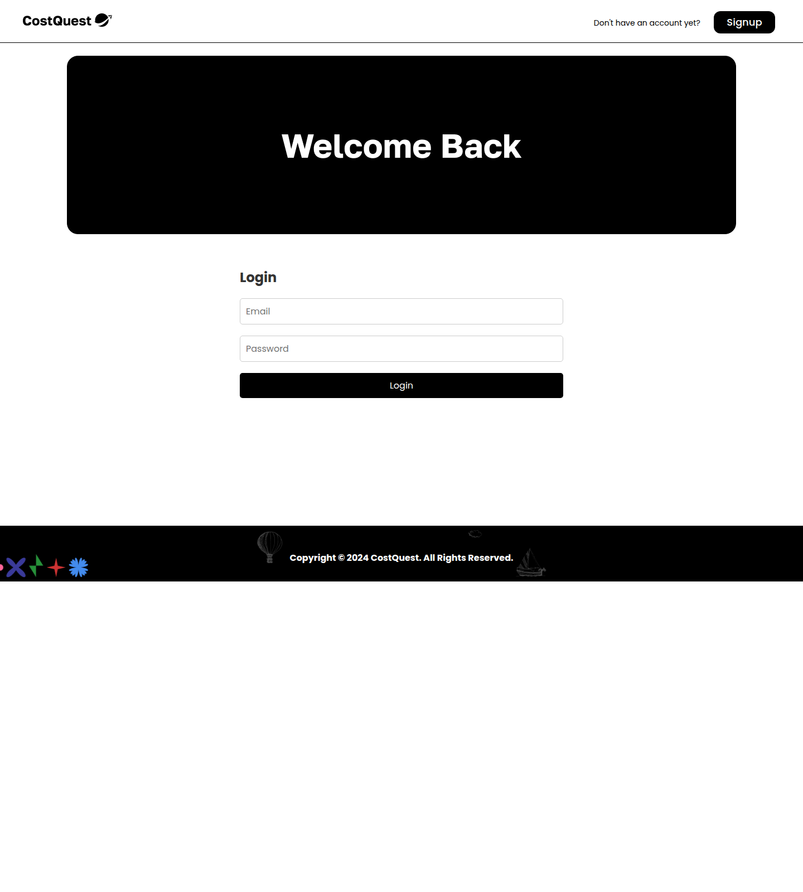
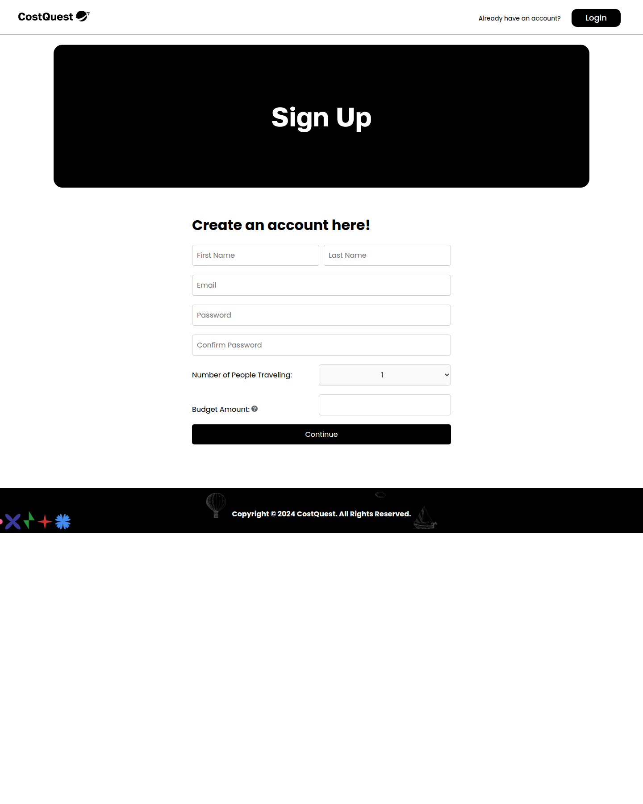
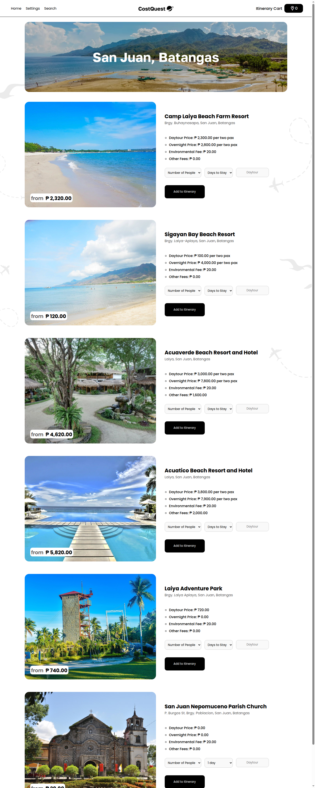
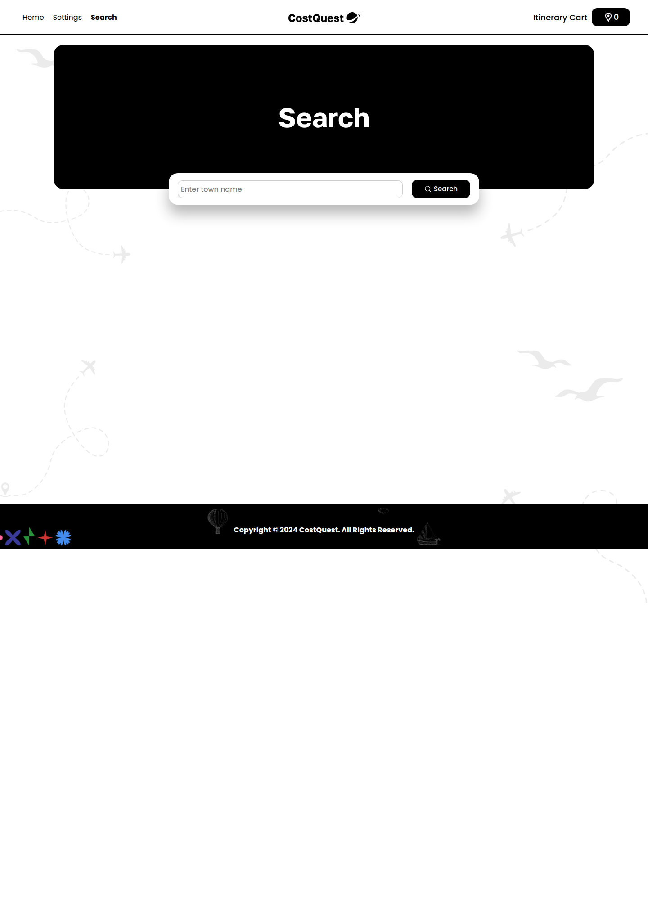
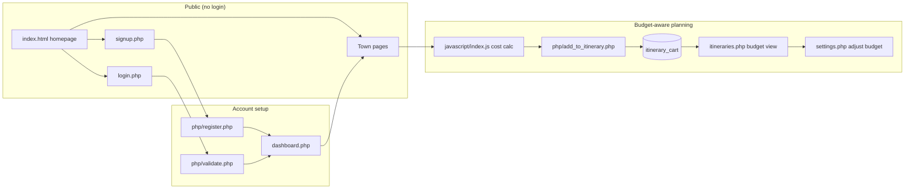
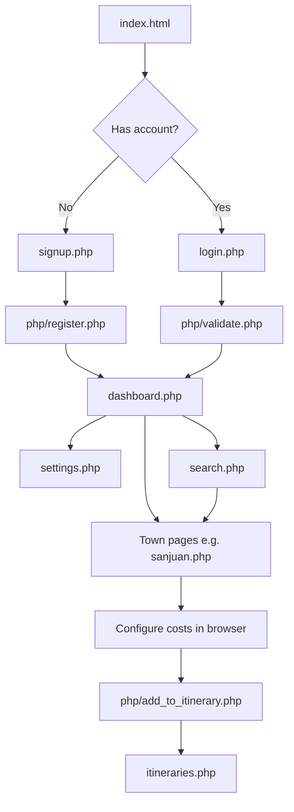

# Cost Quest: A Travel Budget Planner

Cost Quest is a web application that helps travelers plan trips across **Batangas Province, Philippines**. Users can browse 36 destinations across six towns, estimate per-person costs (entrance fees, day tours, overnight stays, environmental fees, and extras), build an itinerary cart, and track whether their planned trip stays within budget.

The project is built with **PHP**, **MySQL**, **HTML/CSS**, and **JavaScript**, and is designed to run on a local stack such as XAMPP or any PHP + MariaDB/MySQL environment.

---

## Why Cost Quest matters

Travel planning in Batangas often involves scattered research — resort websites, entrance fees, environmental charges, and group pricing spread across many sources. Cost Quest solves that by turning trip planning into a **single, budget-aware workflow**:

| Problem | How Cost Quest addresses it |
|--------|-----------------------------|
| Unknown total trip cost | Pre-loaded estimates for 36 destinations with fee breakdowns |
| Budget surprises mid-trip | Users set a budget at signup and see real-time usage on the itinerary page |
| Hard to compare towns | Six town hubs with 6 destinations each, browsable from the homepage |
| Group travel complexity | Per-person calculations based on number of travelers and days stayed |
| Lost planning notes | Itinerary cart persists selections in the database per user account |

Without a tool like this, travelers may underestimate fees (environmental charges, day tour vs. overnight differences, resort extras) and discover they are over budget only after bookings are made. Cost Quest surfaces those numbers **before** the trip, when changes are still easy to make.

---

## Homepage overview

The landing page (`index.html`) is the first touchpoint for every visitor. It is designed to inspire exploration, communicate scale, and funnel users toward signup or town browsing.



The screenshot above shows the primary homepage view: the navigation bar, hero banner, statistics card, and the full six-town destination grid.

### 1. Navigation bar

The fixed top bar keeps **Login** and **Signup** visible at all times. Guests can explore town cards without an account, but saving an itinerary and tracking a personal budget requires authentication.

### 2. Hero section — "Adventura"

The hero banner displays a scenic Batangas landscape with the headline **"Adventura"** and the tagline:

> *Discover your next adventure. Paradise is just around the corner.*

This section sets the tone of the app: travel-first, visually engaging, and focused on Batangas as a destination region.

### 3. Statistics card (center overlay)

Floating over the hero image is a compact stats panel that summarizes what Cost Quest offers at a glance:

| Stat | Meaning |
|------|---------|
| **36 Destinations** | Total curated spots across all six towns in the database |
| **16 Resorts** | Beach and resort-style accommodations with day tour / overnight pricing |
| **6 Towns** | San Juan, Nasugbu, Taal, Calatagan, Lipa City, and Bauan |
| **4 Adventure Spots** | Hiking, water parks, and activity-based locations |

These numbers come directly from the seeded `destinations` table in `database.sql`. They give users immediate confidence that the app covers a substantial, organized catalog — not just a single town or a handful of places.

### 4. Popular Destinations grid

Below the hero, a **3×2 card grid** links to each town page. Every card shows:

- A photo representing the town
- The town name (San Juan, Nasugbu, Taal, Calatagan, Lipa City, Bauan)
- A **"6 destinations"** badge — each town has six pre-loaded spots

Clicking a card opens the corresponding town page (e.g. `sanjuan.php`), where users see individual destinations, pricing, and add-to-itinerary controls.

### 5. "What can I get from CostQuest?" — core value pillars

The bottom section explains **why** the app exists, not just **what** it lists. These three pillars map directly to features inside the logged-in experience:

#### Peace of Mind
Users take control of trip finances through a secure account. Budget limits and itinerary totals are stored in the database, so planning progress is not lost between sessions. The itinerary page shows whether the user is within or over budget before any travel spend happens.

#### Financial Literacy
Cost Quest breaks down spending by destination — entrance fees, environmental fees, day tour vs. overnight rates, and other charges. Users learn where their money goes and can make data-driven decisions (e.g. swapping a resort for a heritage spot to stay under budget).

#### Simplified Cost
Instead of spreadsheets or mental math, the app calculates totals in the browser (`javascript/index.js`) and saves them to `itinerary_cart`. Users categorize spending by destination, set a budget at signup, and review a running total on the itinerary page — effectively a trip expense report built as they plan.

### 6. Footer

The footer displays the copyright notice and closes the public-facing page. From here, users typically proceed to **Signup** to unlock budget tracking and the itinerary cart.

---

## Purpose

Planning a Batangas trip often means juggling many costs across beaches, resorts, heritage sites, and adventure spots. Cost Quest centralizes that work by:

- Showing **estimated costs per destination** so travelers know what to expect before booking.
- Letting users set a **group size and total budget** during signup.
- Providing an **itinerary cart** that totals selected destinations and compares spending against the budget.
- Supporting **six towns**: San Juan, Nasugbu, Taal, Calatagan, Lipa City, and Bauan.

The homepage communicates this purpose visually: the stats card shows scale, the town grid shows where to go, and the three value pillars explain the financial planning benefits once users create an account.

---

## Screenshots

### Landing page

The public homepage introduces the app with the hero banner, destination statistics, and a six-town card grid. Guests can click any town to explore destinations or use **Login** / **Signup** to start budget tracking.


### Login and signup

New users create an account with their name, email, password, number of travelers, and budget. Returning users sign in to access the dashboard.





### Town destination browser

Each town page loads destinations from the database and lets logged-in users configure trip options (day tour vs. overnight, number of people, days) before adding items to the itinerary cart.



### Search

Authenticated users can search by town name and jump directly to the matching destination page.



---

## How it works

Cost Quest follows a clear path from discovery to budget-aware planning. Each step builds on the previous one — the homepage starts the journey, and the database keeps the plan persistent.

### 1. Browse as a guest

Visitors land on `index.html`, explore popular towns, and can open **Login** or **Signup**. Town cards link to pages such as `sanjuan.php`, `nasugbu.php`, and `taal.php`.

**Importance:** Guests can preview the catalog without commitment. The homepage stats (36 destinations, 6 towns) establish trust before asking users to register.

### 2. Create an account

On signup (`signup.php`), users submit:

- First and last name
- Email and password
- Number of people traveling
- Total trip budget (PHP)

`php/register.php` hashes the password, stores the record in the `users` table, starts a session, and redirects to the dashboard.

**Importance:** Budget and group size are captured upfront because every cost calculation downstream depends on them. A group of four travelers splitting resort fees needs different math than a solo day trip — storing `num_people` and `budget` at signup makes all later totals meaningful.

### 3. Explore destinations

After login, users reach `dashboard.php` with featured picks and the same town cards. Each town page:

1. Queries the `destinations` table for that town.
2. Displays images, addresses, fee breakdowns, and estimated totals.
3. Lets users choose **day tour** or **overnight** (when available), set people and days, and calculate a live total with JavaScript (`javascript/index.js`).

**Importance:** This is where abstract budget planning becomes concrete. Users see line items — environmental fees, overnight premiums, other charges — and understand *why* a destination costs what it does, not just a single opaque number.

### 4. Build an itinerary

When a destination is added, `php/add_to_itinerary.php` saves it to `itinerary_cart` with:

- User email
- Destination ID
- Number of people
- Days to stay
- Computed total amount

The navbar **Itinerary Cart** badge updates through `php/get_itinerary_count.php`.

**Importance:** The cart is the planning workspace. Users can add multiple destinations across different towns and see how each choice affects the overall trip cost. Items can be updated or removed without starting over.

### 5. Track budget

`itineraries.php` lists cart items and shows:

- Total spent so far
- Budget limit from the user profile
- Percentage used and a progress bar
- A within-budget or over-budget indicator

Users can adjust budget and account details on `settings.php`, or remove destinations from the cart.

**Importance:** This is the core value delivery of Cost Quest. The progress bar and over/under-budget status turn the app from a directory into a **decision tool** — users know immediately if they need to cut destinations, raise their budget, or redistribute spending before booking anything.

### 6. Search towns

`search.php` accepts a town name and redirects to the matching town page, with autocomplete suggestions powered by client-side JavaScript.

**Importance:** Once users know which town they want, search removes navigation friction and gets them to cost details faster.

---

## How the pieces connect



**Data flow summary:**

1. `destinations` table → town pages render catalog and base prices.
2. User profile (`users`) → provides budget ceiling and traveler count.
3. Browser JavaScript → computes per-destination totals from selected options.
4. `itinerary_cart` → persists choices and summed amounts per user.
5. `itineraries.php` → compares cart total against `users.budget` and renders the progress bar.

---

## Application flow



---

## Features

| Feature | Description |
|--------|-------------|
| Town selection | Six Batangas towns with curated destination lists |
| Cost estimation | Day tour, overnight, environmental, and other fees per destination |
| Personalized budget | User-defined budget and traveler count at signup |
| Itinerary cart | Add, update, and remove destinations with running totals |
| Budget tracking | Progress bar and over/under budget status on the itinerary page |
| Search | Quick navigation to a town by name |
| Account settings | Update email, password, budget, traveler count, or delete account |

---

## Tech stack

- **Frontend:** HTML, CSS, JavaScript
- **Backend:** PHP (session-based auth, REST-style POST handlers)
- **Database:** MySQL / MariaDB
- **Server:** Apache (XAMPP) or PHP built-in development server

---

## Project structure

```
costquest/
├── index.html              # Public landing page
├── login.php / signup.php  # Authentication pages
├── dashboard.php           # Logged-in home
├── itineraries.php         # Itinerary cart and budget summary
├── settings.php            # Account and budget management
├── search.php              # Town search
├── sanjuan.php             # Town destination pages (×6 towns)
├── css/                    # Stylesheets per page/section
├── javascript/index.js     # Cost calculation, cart, UI logic
├── php/                    # Auth, CRUD, and itinerary API scripts
├── icons/                  # Images and UI assets
├── database.sql            # Schema and seed data (36 destinations)
└── docs/screenshots/       # README screenshots
```

---

## Installation (XAMPP)

### 1. Install XAMPP

Download and install [XAMPP](https://www.apachefriends.org/) for Apache, MySQL, and PHP.

### 2. Copy the project

Place this repository inside your XAMPP `htdocs` folder:

```bash
xampp/htdocs/costquest
```

### 3. Start services

Open the XAMPP Control Panel and start **Apache** and **MySQL**.

### 4. Create the database

Open the MariaDB/MySQL shell:

```bash
mysql -h localhost -u root -p
```

Run the SQL in `database.sql` (or import the file):

```sql
CREATE DATABASE costquest;
USE costquest;
-- then run the rest of database.sql
```

This creates three tables:

- `users` — account and budget data
- `destinations` — 36 seeded Batangas locations
- `itinerary_cart` — per-user selected destinations and computed totals

### 5. Open the app

Visit:

```text
http://localhost/costquest/index.html
```

---

## Installation (PHP built-in server)

For a lightweight local run without Apache:

```bash
# From the project root
php -S localhost:8080
```

Ensure MySQL/MariaDB is running and `database.sql` has been imported. Then open:

```text
http://localhost:8080/index.html
```

> **Note:** PHP pages connect to MySQL using `localhost`, `root`, and an empty password by default. Update the credentials in `php/data_database.php` and the town PHP files if your environment differs.

---

## Database overview

| Table | Purpose |
|-------|---------|
| `users` | Stores name, email, hashed password, `num_people`, and `budget` |
| `destinations` | Town, name, address, pricing fields, image filename, and location type |
| `itinerary_cart` | Links a user email to destination IDs with people, days, and `total_amount` |

Destination `location_type` values include `resort`, `hotel`, `spot`, and `adventure`, which affects available booking options on each page.

---

## Key PHP endpoints

| File | Role |
|------|------|
| `php/register.php` | Create user account |
| `php/validate.php` | Login validation |
| `php/add_to_itinerary.php` | Add or update cart item |
| `php/remove_from_itinerary.php` | Remove cart item |
| `php/get_itinerary_count.php` | Return cart count for navbar badge |
| `php/update_budget.php` | Update user budget |
| `php/choose_package.php` | Add preset destination packages |

---

## Development notes

- Sessions identify logged-in users via `$_SESSION['email']`.
- Cost math runs in `javascript/index.js` and is persisted when items are added to the cart.
- Town pages share a similar layout but query different `town` values from the database.
- Static assets (images, CSS) live under `icons/` and `css/`.

---

## License

Copyright © 2024 CostQuest. All Rights Reserved.
