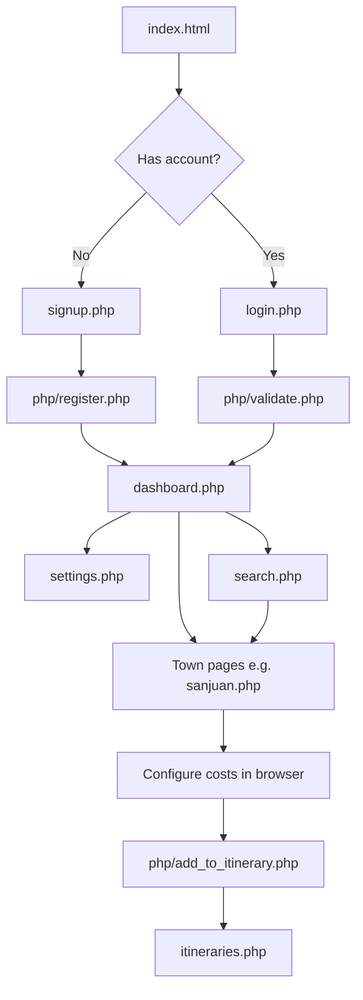

# Cost Quest: A Travel Budget Planner

Cost Quest is a web application that helps travelers plan trips across **Batangas Province, Philippines**. Users can browse 36 destinations across six towns, estimate per-person costs (entrance fees, day tours, overnight stays, environmental fees, and extras), build an itinerary cart, and track whether their planned trip stays within budget.

The project is built with **PHP**, **MySQL**, **HTML/CSS**, and **JavaScript**, and is designed to run on a local stack such as XAMPP or any PHP + MariaDB/MySQL environment.

---

## Purpose

Planning a Batangas trip often means juggling many costs across beaches, resorts, heritage sites, and adventure spots. Cost Quest centralizes that work by:

- Showing **estimated costs per destination** so travelers know what to expect before booking.
- Letting users set a **group size and total budget** during signup.
- Providing an **itinerary cart** that totals selected destinations and compares spending against the budget.
- Supporting **six towns**: San Juan, Nasugbu, Taal, Calatagan, Lipa City, and Bauan.

---

## Screenshots

### Landing page

The public homepage introduces the app, highlights destination statistics, and links to town pages and account creation.


### Login and signup

New users create an account with their name, email, password, number of travelers, and budget. Returning users sign in to access the dashboard.


### Town destination browser

Each town page loads destinations from the database and lets logged-in users configure trip options (day tour vs. overnight, number of people, days) before adding items to the itinerary cart.


### Search

Authenticated users can search by town name and jump directly to the matching destination page.


---

## How it works

### 1. Browse as a guest

Visitors land on `index.html`, explore popular towns, and can open **Login** or **Signup**. Town cards link to pages such as `sanjuan.php`, `nasugbu.php`, and `taal.php`.

### 2. Create an account

On signup (`signup.php`), users submit:

- First and last name
- Email and password
- Number of people traveling
- Total trip budget (PHP)

`php/register.php` hashes the password, stores the record in the `users` table, starts a session, and redirects to the dashboard.

### 3. Explore destinations

After login, users reach `dashboard.php` with featured picks and the same town cards. Each town page:

1. Queries the `destinations` table for that town.
2. Displays images, addresses, fee breakdowns, and estimated totals.
3. Lets users choose **day tour** or **overnight** (when available), set people and days, and calculate a live total with JavaScript (`javascript/index.js`).

### 4. Build an itinerary

When a destination is added, `php/add_to_itinerary.php` saves it to `itinerary_cart` with:

- User email
- Destination ID
- Number of people
- Days to stay
- Computed total amount

The navbar **Itinerary Cart** badge updates through `php/get_itinerary_count.php`.

### 5. Track budget

`itineraries.php` lists cart items and shows:

- Total spent so far
- Budget limit from the user profile
- Percentage used and a progress bar
- A within-budget or over-budget indicator

Users can adjust budget and account details on `settings.php`, or remove destinations from the cart.

### 6. Search towns

`search.php` accepts a town name and redirects to the matching town page, with autocomplete suggestions powered by client-side JavaScript.

---

## Application flow



---

## Features

| Feature | Description |
|--------|-------------|
| Town selection | Six Batangas towns with curated destination lists |
| Cost estimation | Day tour, overnight, environmental, and other fees per destination |
| Personalized budget | User-defined budget and traveler count at signup |
| Itinerary cart | Add, update, and remove destinations with running totals |
| Budget tracking | Progress bar and over/under budget status on the itinerary page |
| Search | Quick navigation to a town by name |
| Account settings | Update email, password, budget, traveler count, or delete account |

---

## Tech stack

- **Frontend:** HTML, CSS, JavaScript
- **Backend:** PHP (session-based auth, REST-style POST handlers)
- **Database:** MySQL / MariaDB
- **Server:** Apache (XAMPP) or PHP built-in development server

---

## Project structure

```
costquest/
├── index.html              # Public landing page
├── login.php / signup.php  # Authentication pages
├── dashboard.php           # Logged-in home
├── itineraries.php         # Itinerary cart and budget summary
├── settings.php            # Account and budget management
├── search.php              # Town search
├── sanjuan.php             # Town destination pages (×6 towns)
├── css/                    # Stylesheets per page/section
├── javascript/index.js     # Cost calculation, cart, UI logic
├── php/                    # Auth, CRUD, and itinerary API scripts
├── icons/                  # Images and UI assets
├── database.sql            # Schema and seed data (36 destinations)
└── docs/screenshots/       # README screenshots
```

---

## Installation (XAMPP)

### 1. Install XAMPP

Download and install [XAMPP](https://www.apachefriends.org/) for Apache, MySQL, and PHP.

### 2. Copy the project

Place this repository inside your XAMPP `htdocs` folder:

```bash
xampp/htdocs/costquest
```

### 3. Start services

Open the XAMPP Control Panel and start **Apache** and **MySQL**.

### 4. Create the database

Open the MariaDB/MySQL shell:

```bash
mysql -h localhost -u root -p
```

Run the SQL in `database.sql` (or import the file):

```sql
CREATE DATABASE costquest;
USE costquest;
-- then run the rest of database.sql
```

This creates three tables:

- `users` — account and budget data
- `destinations` — 36 seeded Batangas locations
- `itinerary_cart` — per-user selected destinations and computed totals

### 5. Open the app

Visit:

```text
http://localhost/costquest/index.html
```

---

## Installation (PHP built-in server)

For a lightweight local run without Apache:

```bash
# From the project root
php -S localhost:8080
```

Ensure MySQL/MariaDB is running and `database.sql` has been imported. Then open:

```text
http://localhost:8080/index.html
```

> **Note:** PHP pages connect to MySQL using `localhost`, `root`, and an empty password by default. Update the credentials in `php/data_database.php` and the town PHP files if your environment differs.

---

## Database overview

| Table | Purpose |
|-------|---------|
| `users` | Stores name, email, hashed password, `num_people`, and `budget` |
| `destinations` | Town, name, address, pricing fields, image filename, and location type |
| `itinerary_cart` | Links a user email to destination IDs with people, days, and `total_amount` |

Destination `location_type` values include `resort`, `hotel`, `spot`, and `adventure`, which affects available booking options on each page.

---

## Key PHP endpoints

| File | Role |
|------|------|
| `php/register.php` | Create user account |
| `php/validate.php` | Login validation |
| `php/add_to_itinerary.php` | Add or update cart item |
| `php/remove_from_itinerary.php` | Remove cart item |
| `php/get_itinerary_count.php` | Return cart count for navbar badge |
| `php/update_budget.php` | Update user budget |
| `php/choose_package.php` | Add preset destination packages |

---

## Development notes

- Sessions identify logged-in users via `$_SESSION['email']`.
- Cost math runs in `javascript/index.js` and is persisted when items are added to the cart.
- Town pages share a similar layout but query different `town` values from the database.
- Static assets (images, CSS) live under `icons/` and `css/`.

---

## License

Copyright © 2024 CostQuest. All Rights Reserved.
